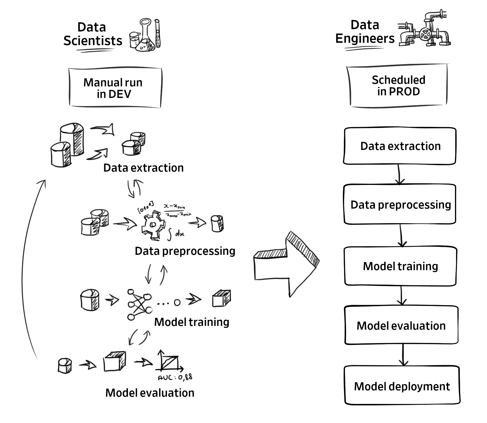
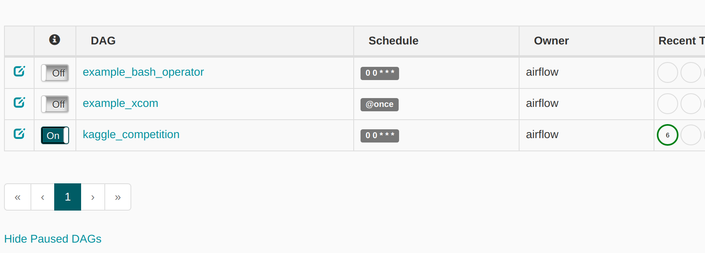
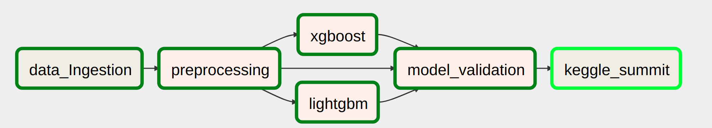
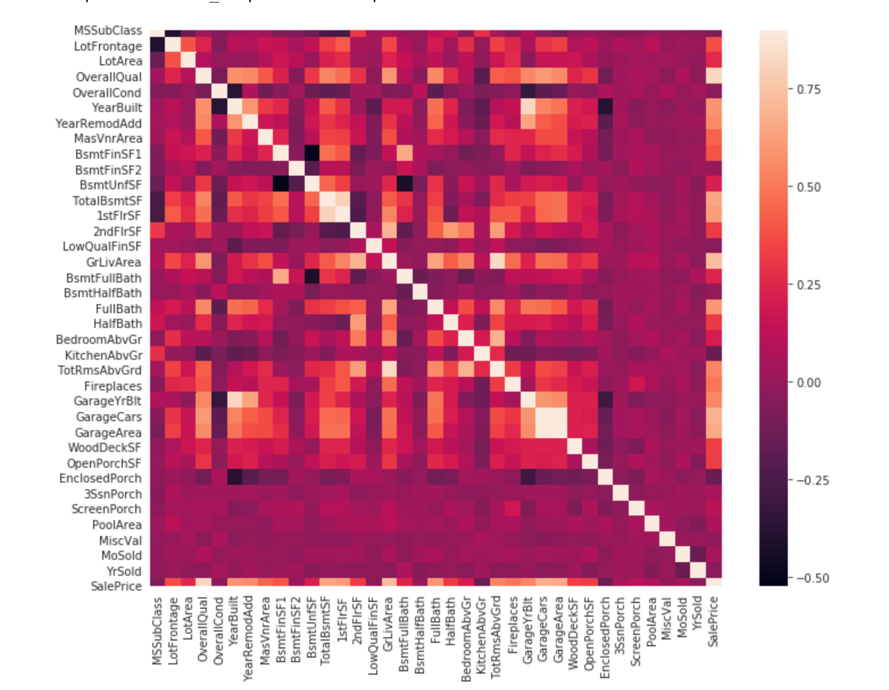
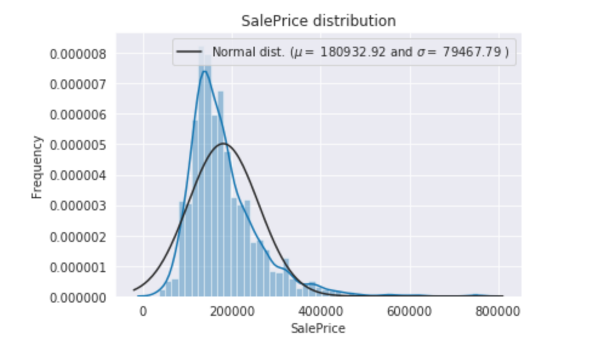
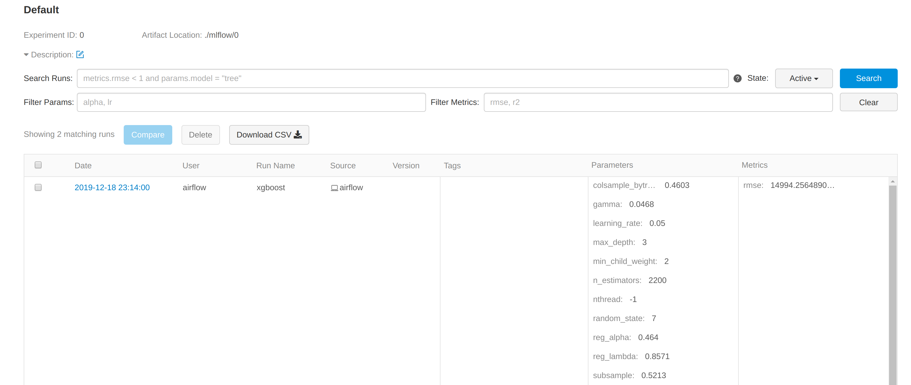
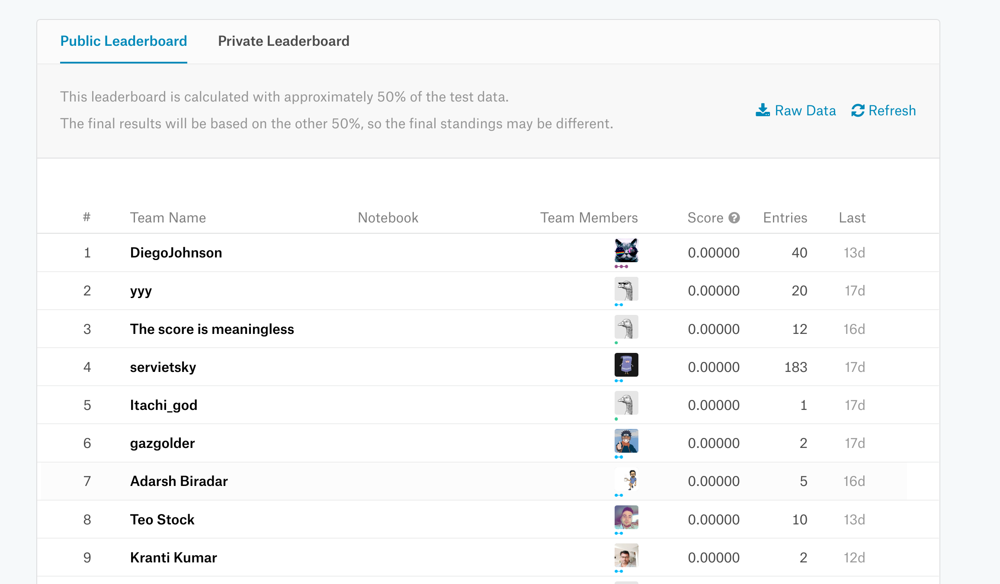

# 2019-minicourse-submarine
DESIGN AND IMPLEMENTATION OF A MACHINE LEARNING PLATFORM


### What is Apache Submarine?

Apache Submarine is a unified AI platform which allows engineers and data scientists to run Machine Learning and Deep Learning workload in distributed cluster.

Goals of Submarine:
- It allows jobs easy access data/models in HDFS and other storages.
- Can launch services to serve TensorFlow/PyTorch models.
- Support run distributed TensorFlow jobs with simple configs.
- Support run user-specified Docker images.
- Support specify GPU and other resources.
- Support launch TensorBoard for training jobs if user specified.
- Support customized DNS name for roles (like TensorBoard.$user.$domain:6006)

### ML code in a real-world ML system is a lot smaller than the infrastructure 


### Deep learning use cases in the real world.




## About this tutorial
 After this tutorial, you will know :
 
 **[Apache Submarine](https://github.com/apache/submarine)** - is Cloud Native Machine Learning Platform
 
 **[Apache airflow](https://github.com/apache/airflow)** -
 a platform to programmatically author, schedule, and monitor workflows.
  
 **[kaggle](https://www.kaggle.com/)** - an online 
 community of data scientists and machine learners. Kaggle allows users to 
 find and publish data sets, explore and build models in a web-based 
 data-science environment, work with other data scientists and machine 
 learning engineers, and enter competitions to solve data science challenges.

 **[jupyter notebook](https://jupyter.org/)** - an open-source web application that allows you to create 
 and share documents that contain live code, equations, visualizations and narrative text

 **[mlflow](https://mlflow.org/)** - An open source platform for the machine learning lifecycle

## Prerequisites
- Ubuntu >= 16.04
- Docker 
- Docker-compose
- memory >= 5G

### Installation
```shell script
sudo apt install docker-compose # install docker-compose
sudo apt-get install docker.io # install docker
service docker status
```

### Install Docker Desktop on Mac
[docker doc](https://docs.docker.com/docker-for-mac/install/)
### Join Kaggle Competition
[House Prices: Advanced Regression Techniques](https://www.kaggle.com/c/house-prices-advanced-regression-techniques)

### Setting kaggle user name and API key in kaggle.json
[create a kaggle's public key](https://www.kaggle.com/docs/api)
```shell script
cd airflow
vim kaggle.json
# {"username":"<Kaggle account username>", "key":"<API key>"}
```
### Build
```shell script
sudo docker-compose build
```

### Usage
```shell script
sudo docker-compose -f docker-compose.yml up
```

### UI Links
- **mlflow** : [localhost:5000](localhost:5000)
- **jupyter notebook** : [localhost:7000](localhost:7000)
- **airflow** : [localhost:8080](localhost:8080)

#### 1.  Turn on airflow DAG


#### 2. Trigger DAG


#### 3. Open data_visualization.ipynb and start visualizing data




#### 4. mlflow compare ml experiments


#### 5. Try to optimize ML model
```python
# open ./dags/src/training.py and tune parameters
params = {
        "colsample_bytree": 0.4603,
        "gamma": 0.0468,
        "learning_rate": 0.05,
        "max_depth": 20,
        "min_child_weight": 2,
        "n_estimators": 2200,
        "reg_alpha": 0.4640,
        "reg_lambda": 0.8571,
        "subsample": 0.5213,
        "random_state": 7,
        "nthread": -1
    }
```

#### 6. Kaggle Leaderboard
[Leaderboard](https://www.kaggle.com/c/house-prices-advanced-regression-techniques/leaderboard)

